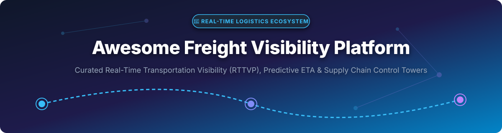

# 🚚 Awesome Freight Visibility Platform 🌐

  

  
  
  
  

## 📌 Top Freight Visibility Platforms Ecosystem 🚛📦

**Curated List of SaaS Products & Open-Source GitHub Projects**

*Focused on Real-Time Transportation Visibility Platforms (RTTVP), Predictive ETAs, Multimodal Shipment Tracking, GPS Telematics & Supply-Chain Control Towers.*

**Last updated: September 2026** 📅

---

This repository tracks notable **SaaS platforms** and **open-source projects** for **Freight Visibility**, **Shipment Tracking**, and **Logistics Execution**. These systems aggregate carrier EDI, telematics, API, and milestone data to provide real-time shipment status, predictive ETAs, exception alerts, and multimodal visibility across road (TL/LTL), ocean, air, and rail.

---

## 📑 Table of Contents
- [🏢 SaaS/Hosted Platforms](#-saashosted-platforms)
- [🔓 Open-Source GitHub Projects](#-open-source-github-projects)
- [🤝 How to Contribute](#-how-to-contribute)
- [💖 Support & Sponsorship](#-support--sponsorship)
- [📈 Star History](#-star-history)
- [⚠️ Disclaimer](#%EF%B8%8F-disclaimer)

---

## 🏢 SaaS/Hosted Platforms

> **📊 Market Intelligence & Industry Structure:**
> The global Real-Time Transportation Visibility Platform (RTTVP) market size is estimated at **$1.5B – $2.1B USD (2026)** and is projected to expand at a CAGR of ~18–22% through 2030. The market is **moderately concentrated** at the top tier among hyper-scale visibility networks (e.g., Descartes, project44, FourKites) due to high network effects in carrier integrations, while remaining **fragmented** in specialized niches (e.g., high-security freight, last-mile execution, region-specific tracking).

| Platform 🚀 | Description 📝 | Scale & Market Footprint (Revenue / Valuation) 📊 | Pricing (Starting Tier) 💵 | Free Tier / Trial Limit ⏱️ |
| :--- | :--- | :--- | :--- | :--- |
| **[Descartes (MacroPoint)](https://www.descartes.com/)** | Global logistics giant; acquired MacroPoint ($107M). Tracks multimodal shipments & carrier networks. | **~$6.8B Valuation (Public: NASDAQ: DSGX)** / ~$779M LTM Revenue | Enterprise contract starting at ~$1,000/month (varies by volume) | No permanent free tier; 14-day enterprise trial available upon demo request |
| **[project44](https://www.project44.com/)** | Category-leading RTTVP enterprise platform covering truckload, LTL, ocean, air, and rail. | **$2.7B Valuation** / ~$134M–$200M ARR | Enterprise subscription starting at ~$15,000/year base platform fee | Free for carrier network onboarding; No free software tier (custom enterprise demo) |
| **[FourKites](https://www.fourkites.com/)** | Enterprise supply-chain visibility platform known for predictive ETAs, yard management, and inventory-in-motion. | **$1.7B Valuation** / ~$114M–$120M ARR | Enterprise pricing starting at ~$12,000/year base tier | No free tier; custom demo sandbox available for prospective enterprise clients |
| **[FarEye](https://www.fareye.com/)** | Intelligent delivery and last-mile logistics orchestration platform. | **~$400M Valuation** / ~$149M ARR | Subscription model starting at ~$1,000/month for fleet & delivery modules | No free plan; 14-day custom demo sandbox upon sales qualification |
| **[Everstream Analytics](https://www.everstream.ai/)** | Predictive supply-chain risk analytics, weather disruption monitoring, and freight visibility platform. | **~$300M Valuation** / ~$78M–$85M ARR | Risk & visibility suite starting at ~$2,500/month | No free tier; interactive live demo upon request |
| **[Shippeo](https://www.shippeo.com/)** | Leading European RTTVP platform with real-time ocean, road, and rail tracking and multimodal ETA calculation. | **~$250M Valuation** / ~$22M–$51M ARR | Enterprise contract starting at ~$10,000/year | Free carrier mobile app; No free platform tier (demo available) |
| **[Overhaul](https://www.overhaul.com/)** | High-security freight visibility and risk management platform specializing in cargo theft prevention. | **~$200M Valuation** / ~$35M ARR | Custom security tracking starting at ~$1,500/month per active fleet segment | No free tier; pilot project evaluations (30-day guided trial) |
| **[Roambee](https://www.roambee.com/)** | Sensor-driven supply-chain visibility platform combining IoT trackers with shipment condition monitoring. | **~$150M Valuation** / ~$25M ARR | Starter tier starting at **$499/month** plus per-sensor hardware rental | No free tier; paid hardware evaluation kit (30-day proof of concept) |
| **[Turvo](https://turvo.com/)** | Collaborative supply-chain software unifying visibility, TMS, and multi-party execution workflows. | **~$100M Valuation** / ~$15M–$30M ARR | Starter portal tier starting at ~$800/month | No free tier; guided workflow demo upon request |
| **[GoComet](https://www.gocomet.com/)** | AI-powered freight management, container tracking, and rate procurement platform for shippers. | **~$50M Valuation** / ~$10M ARR | Modular tracking tier starting at **$299/month** | 14-day free trial for container tracking module |

---

## 🔓 Open-Source GitHub Projects

> **💡 Note on Open-Source Logistics:**
> Network-scale freight tracking relies heavily on commercial carrier API agreements and telematics integrations. However, powerful open-source foundation engines exist for self-hosted GPS tracking, routing, ETA distance calculation, and AI logistics integrations.

| Repository 📦 | GitHub Stars ⭐ | Description 📝 | Primary Use Case 🛠️ |
| :--- | :--- | :--- | :--- |
| **[Project-OSRM / osrm-backend](https://github.com/Project-OSRM/osrm-backend)** |  | High-performance C++ routing engine for OpenStreetMap data. | Shortest-path calculations & ETA matrices |
| **[traccar / traccar](https://github.com/traccar/traccar)** |  | Leading open-source GPS tracking system supporting 200+ protocols & 2000+ models. | Private fleet & IoT asset telematics |
| **[graphhopper / graphhopper](https://github.com/graphhopper/graphhopper)** |  | Fast Java directional routing engine for OpenStreetMap. | Turn-by-turn routing & distance matrices |
| **[valhalla / valhalla](https://github.com/valhalla/valhalla)** |  | Open-source routing engine with turn-by-turn navigation and time-distance matrix capabilities. | Multimodal routing & route optimization |
| **[opentripplanner / OpenTripPlanner](https://github.com/opentripplanner/OpenTripPlanner)** |  | Open-source multimodal passenger and freight journey planning engine. | Multimodal transportation planning |
| **[pgRouting / pgrouting](https://github.com/pgRouting/pgrouting)** |  | Geospatial routing extension for PostGIS / PostgreSQL database systems. | Spatial SQL routing & geofencing |
| **[gis-ops / routingpy](https://github.com/gis-ops/routingpy)** |  | Python library providing a consistent wrapper for popular open & commercial routing APIs. | Multi-provider routing integration |
| **[fleetbase / fleetbase](https://github.com/fleetbase/fleetbase)** |  | Open-source modular logistics operations platform, API & dispatch engine. | Self-hosted dispatch & delivery OS |
| **[cargofy / ATLAS](https://github.com/cargofy/ATLAS)** |  | Model Context Protocol (MCP) server for connecting AI agents to logistics & shipment data. | AI Agent logistics connectors |
| **[fossabot / open-tms](https://github.com/fossabot/open-tms)** |  | Open-source Transportation Management System prototype for load & shipment tracking. | Lightweight TMS & tracking front-end |

---

## 🤝 How to Contribute

Contributions are warmly welcomed! 🌟
1. Fork the repository.
2. Add or update entries in `README.md` following the table format.
3. Keep descriptions factual and link to official documentation or websites.
4. Open a Pull Request with a clear description of your changes.

---

## 💖 Support & Sponsorship

If you find this curated list of **Freight Visibility Platforms & Open-Source Logistics Tools** helpful:
- ⭐ **Star** this repository to show your support!
- 🔀 **Fork** it to keep a personal reference.
- 📢 **Share** it with fellow supply-chain engineers, freight managers, and developers!

☕ **Buy Me a Coffee / Sponsor**:
If you'd like to support the maintenance of awesome open-source lists like this, consider sponsoring on GitHub:
👉 **[Sponsor @ishandutta2007 on GitHub Sponsors](https://github.com/sponsors/ishandutta2007)** ❤️

---

## 📈 Star History

---

## ⚠️ Disclaimer

- This repository is a **community-curated list** for informational and educational purposes only.
- Company valuations, ARR estimates, and pricing tiers are compiled from publicly available disclosures, market intelligence reports, and industry filings.
- Freight visibility processing involves sensitive supply chain data. Ensure proper data protection compliance and agreements when integrating carrier telematics.

---

  Made with ❤️ for the global <b>Supply Chain, Logistics, and Freight Technology</b> community.

